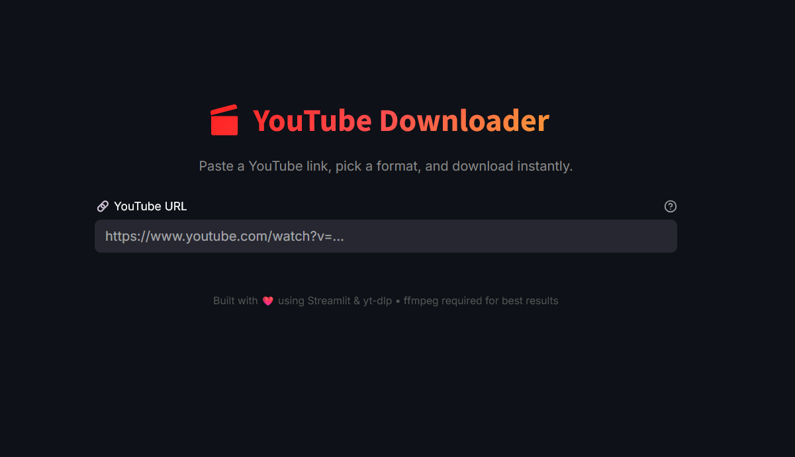

<div align="center">

# 🎬 YouTube Downloader

**A sleek, modern YouTube downloader that runs as a local desktop application.**

Download YouTube videos in MP4 or extract audio as MP3 — with a single click from your desktop.

[](https://python.org)
[](https://streamlit.io)
[](LICENSE)
[](#)

</div>

---

## ✨ Features

| Feature | Description |
|---|---|
| �️ **One-Click Desktop App** | Launch from a desktop shortcut — no terminal knowledge needed |
| 🔍 **Video Preview** | Displays thumbnail, title, uploader, duration and view count |
| 🎵 **Audio Download** | Download best-quality audio and convert to MP3 |
| 🎥 **Video Download** | Choose your resolution (1080p, 720p, 480p, etc.) and download as MP4 |
| 📊 **Progress Bar** | Real-time download progress tracking |
| 🛡️ **Error Handling** | Friendly messages for invalid URLs, restricted videos, and missing dependencies |
| 🔎 **Auto ffmpeg Detection** | Automatically finds ffmpeg on common Windows paths — no manual PATH setup |
| 📦 **Isolated Environment** | Uses a virtual environment (`venv`) to avoid conflicts with other Python projects |

---

## 📸 Screenshot

<div align="center">

</div>

---

## 🚀 Quick Start

### Prerequisites

| Requirement | Details |
|---|---|
| **Python 3.10+** | [Download](https://python.org) — ✅ Check **"Add Python to PATH"** during install |
| **ffmpeg** | [Download](https://ffmpeg.org/download.html) — Extract to `C:\ffmpeg\` (auto-detected) |

### Option A — One-Click Setup (Recommended)

#### Step 1: Install (only once)

Double-click **`install_env.bat`**. It will automatically:
- ✅ Verify Python is installed
- ✅ Create a virtual environment (`venv/`)
- ✅ Upgrade pip and install all dependencies

Wait for the **"Setup Complete!"** message, then press any key to close.

#### Step 2: Launch

Double-click **`run_app.bat`**. The app opens in your browser at `http://localhost:8501`.

---

### Option B — Manual Setup

```bash
# Clone the repository
git clone https://github.com/ErenBalkis/youtube-downloader.git
cd youtube-downloader

# Create & activate virtual environment
python -m venv venv
venv\Scripts\activate

# Install dependencies
pip install -r requirements.txt

# Run the app
streamlit run app.py
```

---

## 🖥️ Desktop Shortcut (Run Like a Real App)

Turn the YouTube Downloader into a desktop application you can launch with a single click:

### 1. Create the Shortcut

1. Open the project folder in **File Explorer**
2. Find **`run_app.bat`**
3. Right-click → **Send to** → **Desktop (create shortcut)**

### 2. Customize the Shortcut

1. On your Desktop, right-click the new shortcut → **Properties**
2. In the **General** tab, rename it to **YouTube Downloader**
3. Go to the **Shortcut** tab:
   - Click **Change Icon…** → **Browse…**
   - Navigate to the project folder → `assets\app_icon.ico` → Select it
   - Set **Run** to **Minimized** *(hides the black console window)*
4. Click **Apply** → **OK**

### 3. Done! 🎉

Now just **double-click the YouTube Downloader icon** on your desktop to launch the app. Your browser will open automatically.

> [!TIP]
> To stop the app, close the console window in the taskbar (or press `Ctrl+C` in the console).

---

## 📖 Usage

1. **Paste** a YouTube URL into the input field
2. **Preview** the video details (thumbnail, title, channel, duration)
3. **Choose** your format:
   - 🎵 **Audio Only (MP3)** — extracts best audio and converts to MP3
   - 🎥 **Video (MP4)** — select your preferred resolution from the dropdown
4. **Click** "Start Download" and watch the progress bar
5. **Save** the file using the download button that appears

---

## 🛠️ Tech Stack

- **[Streamlit](https://streamlit.io/)** — Web UI framework
- **[yt-dlp](https://github.com/yt-dlp/yt-dlp)** — YouTube video/audio extraction
- **[ffmpeg](https://ffmpeg.org/)** — Media processing (stream merging & MP3 conversion)

---

## 📁 Project Structure

```
youtube-downloader/
├── app.py              # Main Streamlit application
├── install_env.bat     # One-click environment setup script
├── run_app.bat         # One-click app launcher script
├── requirements.txt    # Python dependencies
├── generate_icon.py    # Utility to regenerate the app icon
├── assets/
│   └── app_icon.ico    # Custom icon for the desktop shortcut
├── screenshots/
│   └── screenshot1.png # App screenshot for README
├── .gitignore          # Git ignore rules
├── LICENSE             # MIT License
└── README.md           # This file
```

---

## ⚙️ ffmpeg Auto-Detection

The app automatically searches for ffmpeg in these locations:

| Priority | Location |
|---|---|
| 1 | System PATH |
| 2 | `C:\ffmpeg\bin\` |
| 3 | `C:\Program Files\ffmpeg\bin\` |
| 4 | `%USERPROFILE%\ffmpeg\bin\` |
| 5 | `%USERPROFILE%\Downloads\ffmpeg\bin\` |

If ffmpeg is not found, a warning with a download link is displayed in the app.

---

## 📄 License

This project is licensed under the MIT License — see the [LICENSE](LICENSE) file for details.

---
